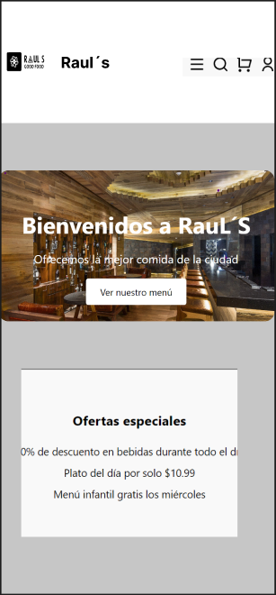
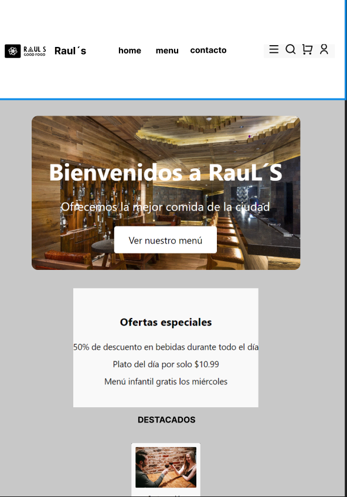
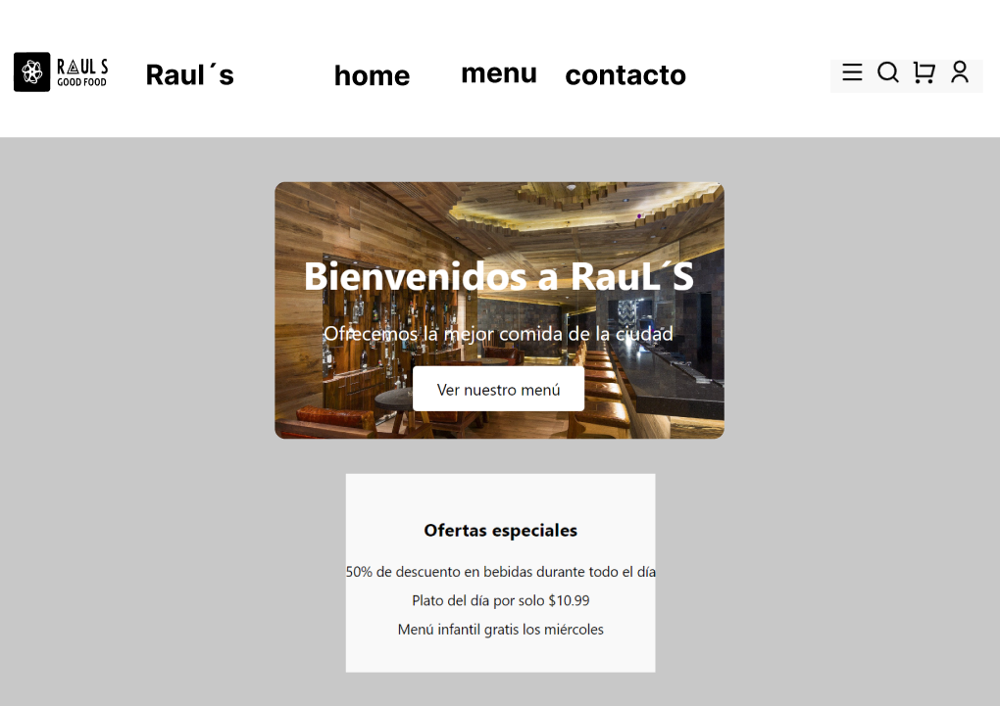
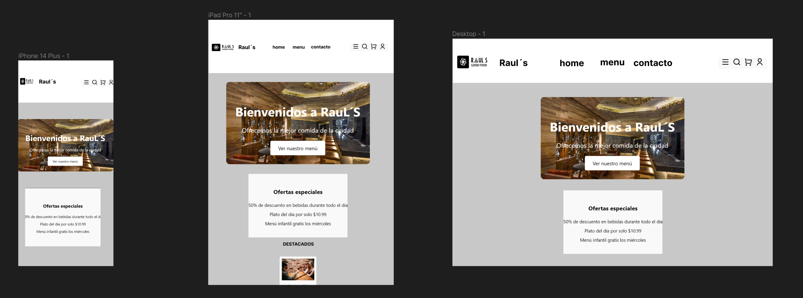

# RauL's Restaurant

## Description

RauL's Restaurant is a web application that allows users to explore and discover various dishes and cuisines offered by the restaurant. It provides an interactive and user-friendly interface to browse the menu, make reservations, and contact the restaurant for inquiries or feedback.

The main features of RauL's Restaurant include:

- **MenuItem**: View a wide range of dishes and explore different categories such as appetizers, main courses, desserts, and beverages.
- **Reservation**: Make online reservations for a specific date and time, and receive confirmation.
- **ContactForm**: Easily get in touch with the restaurant via phone or email for inquiries or feedback.
- **Reviews**: Read and submit reviews about the restaurant and its dishes.
- **Reserve**: Is a status component that allows you to book when you click and has a maximum number of bookings. 
- **ShopMap**: You can see where all the restaurants are located on the map.
- **FeatureItems**: You can see the variety of cooking styles in the restaurant.
- **CarouselComponent**: Made with react-responsive-carousel you can see images of the plates moving

## Third-Party Components

RauL's Restaurant utilizes the following third-party components:

- [React](https://reactjs.org): A JavaScript library for building user interfaces.
- [React Router](https://reactrouter.com): A library for routing and navigation within the React application.
- [Leaflet](https://leafletjs.com): An open-source JavaScript library for interactive maps.
- [React Leaflet](https://react-leaflet.js.org): A React wrapper for Leaflet library to integrate maps into the application.
- [React Icons](https://react-icons.github.io/react-icons/): A collection of customizable icons for React applications.
- [React Responsive Carousel](https://www.npmjs.com/package/react-responsive-carousel): A React module used in frontend apps to display video and image galleries, make sales, and display connected blogs.

## Tutorials

The following tutorials were helpful during the development of RauL's Restaurant:

- [React Crash Course by Traversy Media](https://www.youtube.com/watch?v=w7ejDZ8SWv8)
- [React Router Tutorial by The Net Ninja](https://www.youtube.com/watch?v=Law7wfdg_ls)
- [Leaflet Quick Start Guide](https://leafletjs.com/examples/quick-start/)
- [FreeCodeCamp](https://www.youtube.com/watch?v=6Jfk8ic3KVk&t=25923s)

## README.md

- [Best README.md Template](https://github.com/othneildrew/Best-README-Template) - A useful template for creating professional README.md files.

## Project prototypes 

## Installation

To run RauL's Restaurant locally, follow these steps:

1. Clone the repository: `git clone https://github.com/raul-elrincon/Restaurante.git`
2. Navigate to the project directory: `cd RESTAURANTE`
3. Install the dependencies: `npm install`
4. Set up the environment variables required for configuration.
5. Start the application: `npm start`

Make sure you have Node.js and npm installed on your machine before proceeding with the installation.

## Usage

Once the application is up and running, you can access it through the provided URL or local development server. Explore the menu, make reservations, and contact the restaurant using the intuitive interface. Enjoy discovering the delicious dishes offered by RauL's Restaurant!

## Contributions

Contributions to RauL's Restaurant are welcome! If you would like to contribute, please follow these steps:

1. Fork the repository.
2. Create a new branch for your modifications: `git checkout -b feature/new-feature`
3. Make the changes and commit them with descriptive messages.
4. Push your changes to your remote repository: `git push origin feature/new-feature`
5. Open a pull request in this repository and describe your changes in detail.

## License

This project is licensed under the MIT License. You are free to use, modify, and distribute the code for personal and commercial purposes.

Enjoy exploring the world of RauL's Restaurant and have a delightful culinary experience!
